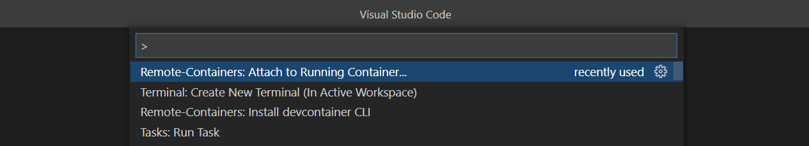
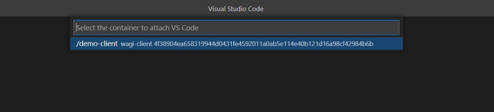

# Demo - deploying, running and updating a WAGI Module in webapps using Bindle

This repo contains a demo of creating a WAGI dotnet app , that obtains its configuration from a Bindle Server and is hosted in an Azure Web App.


## Prerequisites

1. Docker.
1. An Azure Account.


## Setting things up

### Start the container 

`docker run -it --rm --name demo-client ghcr.io/simongdavies/wagi-dotnet-bindle:latest`

### Set environment variables in the container:

``` shell
export DEMO_RESOURCE_GROUP=<resource-group> 
export DEMO_LOCATION=<location> 
echo export BINDLE_USERNAME=<username> >> ~/.bashrc
echo export BINDLE_PASSWORD=<password> >> ~/.bashrc
echo export DEMO_LOCATION=${DEMO_LOCATION} >> ~/.bashrc
echo export DEMO_WEBAPPNAME=<webappname> >> ~/.bashrc
echo export DEMO_RESOURCE_GROUP=${DEMO_RESOURCE_GROUP} >> ~/.bashrc

```

### Login to Azure

``` shell
az login
# if you have access to multiple subscriptions then set the one to use for the demo
az account set -s <subscription-id>
```

### Create a resource group

``` shell
az group create -n ${DEMO_RESOURCE_GROUP} -l ${DEMO_LOCATION}
```

### Run vscode and connect to the container

1. Start vscode.
1. If necessary, install the [remote container extension](https://marketplace.visualstudio.com/items?itemName=ms-vscode-remote.remote-containers).
1. Connect to the container `Remote-Containers: Attach to Running Container..`:



Then select the container:



## Run the demo

Open 2 terminals in VS Code.

In the first terminal, run the following command:

``` shell
az deployment group create -g ${DEMO_RESOURCE_GROUP} --template-uri https://raw.githubusercontent.com/simongdavies/bindle-server-docker/main/azuredeploy.json  -p bindleServerUserName=${BINDLE_USERNAME} -p bindleServerPassword="${BINDLE_PASSWORD}" -o tsv --query 'properties.outputs.bindleUrl.value'
```

While this command is running in the second terminal, run the following commands:

``` shell
cd /tmp
mkdir wagiapp dotnetapp
cd wagiapp
```

When the command in the first terminal completes it will output the URL of the Bindle Server simimialr to this `export BINDLE_URL=https://883e683dcc435c49a35502f912d51b04.northeurope.azurecontainer.io/v1`.

Copy this command and execute it in both terminals.

In the second terminal run the following commands:

``` shell
yo wasm --no-insight
? What is the name of the WASM module? wagiapp
? What type of application is the module? Web service or application using WAGI
? What is the name of the author? Simon Davies
? What programming language will you write the module in? Rust
? Where do you plan to publish the module? Hippo
? What is the URL of your Hippo service? https://hippo.hippofactory.io/
? What is the URL of your Hippos Bindle server? https://883e683dcc435c49a35502f912d51b04.northeurope.azurecontainer.io/v1
? Would you like to create a new Hippo application for this project? No

cargo build --target wasm32-wasi --release
hippo bindle -v production .
```

In the first terminal execute the following commands:

``` shell
cd /tmp/dotnetapp
dotnet new wagi-bindle --bindle-server-url ${BINDLE_URL} --bindle-name wagiapp/0.1.0
az webapp up --logs --os-type linux --name ${DEMO_WEBAPPNAME} --sku f1 -l ${DEMO_LOCATION} --resource-group ${DEMO_RESOURCE_GROUP} -b

```

When the app has been created and deployed you should see a browser window opened to the URL of the web app.

Now you can update the application:

Edit the file /tmp/wagiapp/src/main.rs and replace line 3 with:

```rust
println!("Hello, world! v 0.2.0");

```

Edit the file /tmp/wagiapp/HIPPOFACTS and replace line 3 with

```toml
version = "0.2.0"
```

Run the following commnands:

```shell
cargo build --target wasm32-wasi --release
hippo bindle -v production .
az webapp config appsettings set --name ${DEMO_WEBPPNAME} -g ${DEMO_RESOURCE_GROUP} --settings WAGI__BINDLES__BINDLEMODULE__NAME="wagiapp/0.2.0"
```

## Clean Up

Delete the resources created by the demo:

``` shell
az group delete -n ${DEMO_RESOURCE_GROUP}
```
